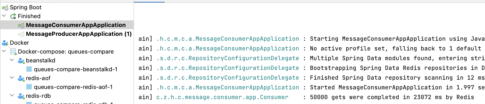

# queues-compare
Demo project for Comparison of queues performance

## Services

### message-producer-app
Producer implementation [Producer.java](message-producer-app%2Fsrc%2Fmain%2Fjava%2Fcom%2Fzma%2Fhighload%2Fcourse%2Fmessage%2Fproducer%2Fapp%2FProducer.java)

2 clients:
* redis lpush [RedisClient.java](message-producer-app%2Fsrc%2Fmain%2Fjava%2Fcom%2Fzma%2Fhighload%2Fcourse%2Fmessage%2Fproducer%2Fapp%2Fclient%2FRedisClient.java) 
* [BeanstalkdClient.java](message-producer-app%2Fsrc%2Fmain%2Fjava%2Fcom%2Fzma%2Fhighload%2Fcourse%2Fmessage%2Fproducer%2Fapp%2Fclient%2FBeanstalkdClient.java)

### message-consumer-app

Consumer implementation [Consumer.java](message-consumer-app%2Fsrc%2Fmain%2Fjava%2Fcom%2Fzma%2Fhighload%2Fcourse%2Fmessage%2Fconsumer%2Fapp%2FConsumer.java)

2 clients: 
* redis rpop [RedisClient.java](message-consumer-app%2Fsrc%2Fmain%2Fjava%2Fcom%2Fzma%2Fhighload%2Fcourse%2Fmessage%2Fconsumer%2Fapp%2Fclient%2FRedisClient.java) 
* [BeanstalkdClient.java](message-consumer-app%2Fsrc%2Fmain%2Fjava%2Fcom%2Fzma%2Fhighload%2Fcourse%2Fmessage%2Fconsumer%2Fapp%2Fclient%2FBeanstalkdClient.java)

### Redis with Snapshot data persistence
hostname: localhost

port: 6379

snapshot is saved to disc every *1* second

### Redis with AOF data persistence
hostname: localhost

port:6380

### Beanstalkd
hostname: localhost

port: 11300

### Comparison results
metrics | redis rdb | redis aof | beanstalkd 
--- | --- | --- | --- 
50000 puts | 25584 ms	| 40427 ms	| 18811 ms
50000 gets | 23072 ms |	39681 ms |	38243 ms
puts ops/sec |	1954 |	1236 |	2658
gets ops/sec |	2167 |	1260 |	1307

logs example